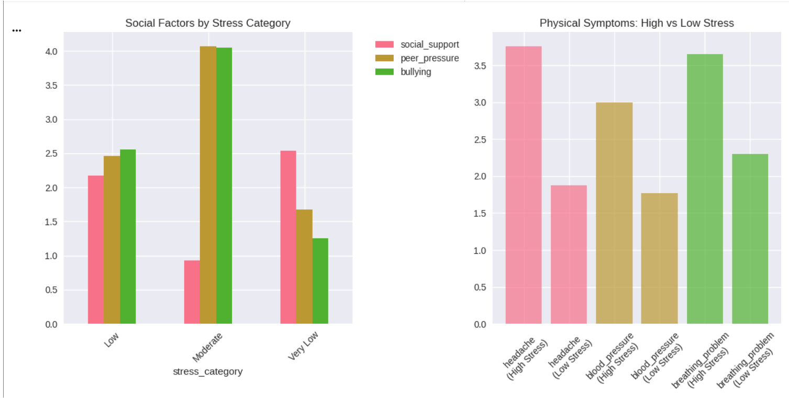
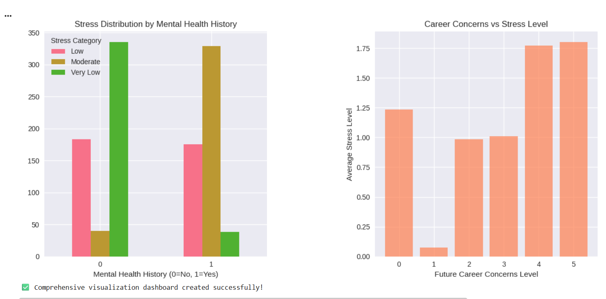

# 🎓 Student Stress Monitoring & Prediction System

## 📌 Project Overview
This project applies **data analytics and machine learning** to identify, predict, and explain student stress levels using behavioral, academic, psychological, and environmental data.

The goal is not just prediction, but **actionable decision support** — enabling institutions to **detect at-risk students early**, design **targeted interventions**, and improve overall student wellbeing and academic outcomes.

This project simulates a **real-world education analytics / public health use case**.

---

## 🧠 Business / Institutional Problem
Educational institutions often struggle to:
- Detect student stress early
- Understand *why* stress occurs
- Allocate mental health resources effectively
- Balance academic performance with wellbeing

Stress is usually identified **too late**, after academic decline or mental health crises.

---

## 🎯 Project Objectives
- Predict high-stress students using data-driven models
- Identify the **key drivers of stress**
- Segment students into **intervention-ready groups**
- Translate analytics into **clear, operational recommendations**
- Support **policy, academic, and mental health decisions**

---

## 📊 Dataset Summary
- **Total students analyzed:** 1,100  
- **High-stress students:** 369 (33.5%)  
- **Students with mental health history:** 542  
- **Average stress level:** 1.00  

Data includes:
- Psychological factors (anxiety, depression, self-esteem)
- Academic performance
- Sleep quality
- Bullying exposure
- Environmental stressors
- Mental health history

---

## 🔍 Key Analytical Insights

### 📈 Strongest Drivers of Stress
| Feature | Correlation |
|------|------------|
| Self-esteem | 0.756 |
| Bullying exposure | 0.751 |
| Sleep quality | 0.749 |
| Career uncertainty | 0.743 |
| Anxiety level | 0.737 |

**Key Insight:**  
Stress is driven primarily by **psychosocial and lifestyle factors**, not academics alone — highlighting the need for **holistic interventions**.

## 📊 Analysis Visualizations (Python)

The following visualizations were generated directly from the Python analysis
to support interpretation, stakeholder decision-making, and intervention design.

### Environmental Factors by Stress Category

### Social Factors and Physical Symptoms by Stress Level

### Stress Distribution by Mental Health History and Career Concerns

### Stress Level Distribution and Anxiety vs Depression

---

## 🧩 Student Segmentation & Insights

### 🚨 High-Stress Students (369 students)
**Profile:**
- Elevated anxiety and depression
- Low self-esteem
- High exposure to stressors

**Recommended Actions:**
- Immediate counseling support
- Stress management workshops
- Reduced or flexible academic workload
- Peer support groups
- Continuous mental health monitoring

---

### 🎭 Low Self-Esteem Students (267 students)
**Interventions:**
- Confidence and self-esteem programs
- Mentorship initiatives
- Recognition and positive reinforcement systems

---

### 📚 Poor Academic Performance Group (561 students)
**Support Strategies:**
- Targeted tutoring
- Study skills and time management training
- Learning-style assessments
- Improved teacher–student engagement

---

### 🧠 Students with Mental Health History (542 students)
**Observed Pattern:**  
Higher average stress levels compared to peers.

**Specialized Support:**
- Regular psychological evaluations
- Personalized treatment plans
- Crisis intervention protocols
- Family involvement where appropriate

---

## 🏫 Institutional-Level Recommendations

### 🔔 Early Warning System
- Predictive models to flag at-risk students
- Automated alerts for counselors and academic staff
- Regular stress-level monitoring

### 🧘 Mental Health Programs
- Mandatory stress management education
- Mindfulness and resilience training
- 24/7 counseling access
- Peer counselor programs

### 📚 Academic Policy Adjustments
- Flexible schedules for high-risk students
- Adaptive academic workloads
- Mental health awareness training for educators

### 🌍 Environmental Improvements
- Reduce noise pollution (274 students affected)
- Improve living conditions (551 students affected)
- Enhance campus safety (565 students affected)
- Expand quiet study and wellness spaces

---

## 🛡️ Prevention & Long-Term Strategy
- Routine mental health screenings
- Resilience-building programs
- Social support network development
- Life skills and time management training
- Healthy sleep and lifestyle promotion

---

## 📊 Success Metrics (KPIs)
- Reduction in high-stress student percentage
- Improvement in academic performance
- Increased self-esteem scores
- Reduced anxiety and depression levels
- Higher student satisfaction with support services

---

## 🚀 Business Impact
If implemented, this system can:
- Reduce student burnout and dropout rates
- Improve academic outcomes
- Optimize counseling resource allocation
- Enable proactive, data-driven policy decisions
- Support scalable mental health interventions

---

## 🧰 Tools & Technologies
- **Python** (pandas, NumPy, scikit-learn)
- **Data Analysis & EDA**
- **Machine Learning (Classification)**
- **Statistical Analysis**
- **Data Visualization**
- **Decision Analytics**

---

## 📌 Why This Project Matters
This project demonstrates:
- End-to-end analytics thinking
- Translation of ML outputs into real-world decisions
- Experience with education, health, and social impact data
- Strong storytelling with data
- Readiness for **Data Analyst, Data Scientist, Health Analytics, and EdTech roles**

---

## 📬 Author
**Francis Affonah**  
Data Scientist | Data Analyst  
